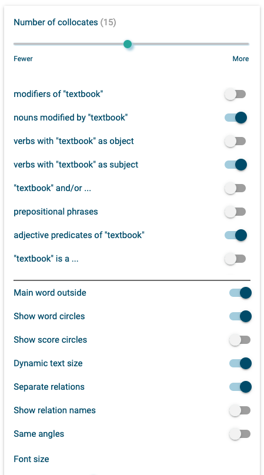

# Textbook English

Welcome to the companion website to my PhD thesis! **Please note that this website is under construction!**

This is the online appendix. It includes the full code for all the analysis and the figures. The code itself and, copyright permitting, the data to run it are available in the associated GitHub repository. All the code published on this page and in the repository is licensed under ???. The plots and tables are all licensed under CC-BY 4.0.

The thesis itself is available upon request.

You can use the [editor on GitHub](https://github.com/elenlefoll/TextbookEnglish/edit/gh-pages/index.md) to maintain and preview the content for your website in Markdown files.

Whenever you commit to this repository, GitHub Pages will run [Jekyll](https://jekyllrb.com/) to rebuild the pages in your site, from the content in your Markdown files.

## 1. Introduction

The opening chapter features a word cloud of the some of the most frequent lemma collocates of the lemma textbook as found in the EnTenTen20 corpus. This word cloud was created using the Word Sketch function on sketchengine.eu and can be interactively explored at: <a href="https://ske.li/textbook" title="Collocates of TEXTBOOK" target="_blank" rel="noopener noreferrer">https://ske.li/textbook</a>. The following settings were used to create the version of the word cloud printed in Chapter 1:

 </div>

## 2. Literature review

This is a <a href="LitReviewTable.html" title="Literature review table" target="_blank" rel="noopener noreferrer">tabular overview</a> of all the Textbook English studies I examined as part of my literature review.

## 3. Research aims and corpus data

## 4. Exploring the progressive in Textbook English

Pre-annotation script

<a href="4_Prog_Conversation_Morphosyntactic_Analysis.html" title="Progressives in Textbook Conversation" target="_blank" rel="noopener noreferrer">The morphosyntactic analysis of progressives in Textbook Conversation</a>

<a href="4_Prog_Fiction_Morphosyntactic_Analysis.html" title="Progressives in Textbook Fiction" target="_blank" rel="noopener noreferrer">The morphosyntactic analysis of progressives in Textbook Fiction</a>

<a href="4_Prog_Semantic_Collostructional_Analysis.html" title="Semantic and collostructional analyses" target="_blank" rel="noopener noreferrer">The semantic and collostructional analysis of progressives in Textbook Conversation and Fiction</a>

## 5. MAKE sense of MAKE in Textbook English

## 6. Additive MDAs

## 7. A new multi-dimensional model of Textbook English

## 8. Summary and pedagogical implications

```markdown
Syntax highlighted code block

# Header 1
## Header 2
### Header 3

- Bulleted
- List

1. Numbered
2. List

**Bold** and _Italic_ and `Code` text

[Link](url) and 
```

For more details see [Basic writing and formatting syntax](https://docs.github.com/en/github/writing-on-github/getting-started-with-writing-and-formatting-on-github/basic-writing-and-formatting-syntax).

### Jekyll Themes

Your Pages site will use the layout and styles from the Jekyll theme you have selected in your [repository settings](https://github.com/elenlefoll/TextbookEnglish/settings/pages). The name of this theme is saved in the Jekyll `_config.yml` configuration file.

### Support or Contact

Having trouble with Pages? Check out our [documentation](https://docs.github.com/categories/github-pages-basics/) or [contact support](https://support.github.com/contact) and we’ll help you sort it out.
